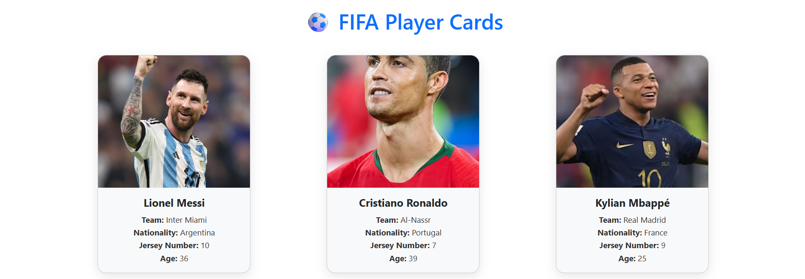

# ⚽️ FIFA Player Cards

> A React application that displays stylish FIFA player cards using React-Bootstrap.


---

## 🌟 Demo

📸 _Coming soon..._


---

## ⚙️ Technologies Used

- ⚛️ **React**
- 🎨 **React-Bootstrap**
- 🧩 **Bootstrap**
- ✏️ **JSX**
- 🌐 **JavaScript ES6**

---

## ✨ Features

- 🎴 Display a list of football players with name, nationality, team, etc.
- 💡 Reusable component design using React
- 🚀 Props with destructuring and default values
- 🎨 Custom styling using Bootstrap and inline CSS
- 🧠 Data-driven rendering via `.map()`

---

## 🧪 Installation

```bash
# 1. Clone the repo
git clone https://github.com/your-username/fifa-player-cards.git

# 2. Go into the project directory
cd fifa-player-cards

# 3. Install dependencies
npm install

# 4. Start the React app
npm start
